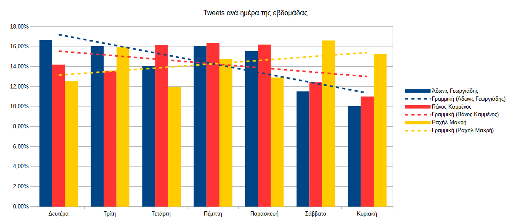

# Tweets σε σχέση με το χρόνο

Για να δούμε πώς διακυμαίνεται το συναίσθημα σε σχέση με το χρόνο πρέπει να 
υπολογίσουμε το μέσο συναίσθημα κάθε ημέρας.

Με το αρχείο `final_tweets.csv` μπορούμε να δημιουργήσουμε άμεσα διάφορα 
διαγράμματα καθώς περιέχει συγκεντρωτικά στοιχεία για όλους τους χρήστες.

Δημιουργούμε ένα διάγραμμα με τρεις σειρές δεδομένων, μία για κάθε
χρήστη χρησιμοποιώντας τα περιεχόμενα των κελιών με τον αριθμό των tweets, 
ενώ ως περιοχή ετικετών βάζουμε τη στήλη `A` με τις ημερομηνίες.

Το αποτέλεσμα είναι το ακόλουθο:

Παρατηρούμε όμως ότι οι τρεις χρήστες δεν έχουν το ίδιο εύρος ημερομηνιών.
Αυτό συμβαίνει λόγω του περιορισμού του Twitter στα 3240 πιο πρόσφατα tweets. 
Σαν αποτέλεσμα αυτού, χρήστες με πολλά tweets ανά ημέρα είχαν συνολικά μικρό 
εύρος ημερών και το αντίστροφο. Πιο συγκεκριμένα, ο Άδωνις Γεωργιάδης που κάνει
τα πιο πολλά tweets ανά ημέρα έκανε 3240 tweets την περιόδο 11/9/2016 έως σήμερα 
δηλαδή μόλις σε 2 μήνες ενώ ο Πάνος Καμμένος για παράδειγμα που τουΐταρε πολύ 
πιο αραιά έκανε την ίδια ποσότητα tweets από τις 28/9/2014 έως σήμερα δηλαδή σε 
περίοδο 2 ετών!

Έτσι δημιουργούμε ένα νέο διάγραμμα που παίρνει στοιχεία μόνο από τις ημερομηνίες
που είναι κοινές και στους τρεις. Κάτι σαν να ζουμάρουμε το διάγραμμα στην κοινή
περιοχή. 

Το αποτέλεσμα είναι το ακόλουθο:

> Τα διαγράμματα μπορούν να βρεθούν στο αρχείο
[final_tweets.ods](https://github.com/Protonotarios/get-tweets/blob/version02/docs/%CE%A0%CE%B1%CF%81%CE%AC%CE%B4%CE%B5%CE%B9%CE%B3%CE%BC%CE%B1/final_tweets.ods).

### Παρατηρήσεις

Το πρώτο πράγμα που παρατηρούμε, που το γνωρίζαμε άλλωστε, είναι τεράστια διαφορά 
του Αδώνιδος Γεωργιάδη με τους άλλους δύο, οι οποίοι είναι λίγο πολύ στο ίδιο
επίπεδο. Ο Άδωνις Γεωργιάδης όμως φαίνεται να τουϊτάρει με δεκαπλάσιο ρυθμό 
φτάνοντας καμιά φορά κοντά στα 100 tweets την ημέρα.

Αυτό δείχνει ότι είναι άνθρωπος των media που αναγνωρίζει τη σημασία τους και 
αξιοποιεί το Twitter ως τέτοιο.

Μια άλλη παρατήρηση είναι η πτωτική τάση του Πάνου Καμμένου που ξεκινάει από
αρχές του 2015 δηλαδή από τότε που αναλαμβάνει Υπουργός Εθνικής Άμυνας.

Η πτώση αυτή μπορεί να οφείλεται σε διάφορες πιθανές αιτίες, όπως:

* Τα καθήκοντα ενός υπουργού δεν αφήνουν χρόνο για το Twitter, ή
* Ο θεσμικός ρόλος ενός υπουργού απαιτεί λιγότερες δηλώσεις, ή
* Από τη στιγμή που κάποιος είναι στην κυβέρνηση δεν έχει τόση ανάγκη για δημόσιες 
σχέσεις όσο πριν, κ.ά.

Δεν θα εμβαθύνουμε περισσότερο στο πού μπορεί να οφείλεται καθώς αυτό ξεφεύγει από
τους στόχους της παρούσας εργασίας.

# Retweets σε σχέση με το χρόνο

Με τον ίδιο τρόπο μπορούμε να φτιάξουμε το διάγραμμα για τα retweets.

Εδώ η διαφορά μεταξύ Αδώνιδος Γεωργιάδη και των άλλων δύο είναι τεράστια.
Τα retweets στον Πάνο Καμμένο και στη Ραχήλ Μακρή κυμαίνονται σε 1-2 εκατοντάδες
όταν ο Άδωνις Γεωργιάδης φτάνει μερικές χιλιάδες. Η διαφορά πλέον είναι πάνω από
δεκαπλάσια.

Αυτό σημαίνει ότι η αξιοποίηση των media από τον Άδωνι Γεωργιάδη φαίνεται να 
λειτουργεί πολλαπλασιαστικά.

# Αγαπημένα σε σχέση με το χρόνο

Ομοίως μπορούμε να φτιάξουμε το διάγραμμα για τα *αγαπημένα*, κοινώς τα «like»
που συγκεντρώνει κάθε χρήστης ανά ημέρα.

Παρατηρούμε κι εδώ σχεδόν την ίδια διάταξη αλλά με μικρότερα νούμερα.
Αυτό οφείλεται στο ότι κυριάρχος θεσμός στο Twitter είναι το *retweet* 
και όχι τόσο το *αγαπημένο* όπως είναι σε άλλα κοινωνικά δίκτυα.

Παρατηρούμε επίσης όμως ότι υπάρχει και μια ελαφρώς διαφορετική σημασία 
ανάμεσα στα *retweets* και στα *αγαπημένα* γιατί τα διαγράμματα δεν είναι
ακριβώς ίδια.

# Retweets vs αγαπημένα

Για το λόγο αυτόν δημιουργούμε κι ένα διάγραμμα που να συγκρίνει retweets με 
αγαπημένα. Επειδή τα retweets είναι πολύ περισσότερα αναλογικά, κανονικοποιούμε
τις τιμές ώστε να εμφανίζονται ίδιας τάξεως και τα δύο. Οι τιμές των retweets 
εμφανίζονται δεξιά, στον κόκκινο άξονα ενώ οι τιμές των αγαπημένων στον αριστερό
μπλε άξονα.

Όπως φαίνεται και στο διάγραμμα, τα αγαπημένα δεν συμβαδίζουν με τα retweet.
Υπάρχουν περίοδοι που κυριαρχούν πότε τα μεν και πότε τα δε καθώς και περίοδοι
που υπάρχει σχεδόν μόνο το ένα από δύο. Αυτό δείχνει ότι έχουν διαφορετικό
χαρακτήρα.

Ενδιαφέρον παρουσιάζουν οι δύο μεγάλες κορυφές που συμπίπτουν η πρώτη με το 
Δημοψήφισμα και η δεύτερη με τις Εκλογές. Μπορούμε να ζουμάρουμε εκεί και να
τις μελετήσουμε καλύτερα.

Το πρωτο πυκνό τμήμα είναι γύρω από το Δημοψήφισμα που έγινε στις 5 Ιουλίου. 

Εκεί παρατηρούμε ότι κυριαρχούν τα αγαπημένα έναντι των retweet.

Αντίθετα, η αμέσως επόμενη κορυφή είναι πριν τις Εκλογές, που έγιναν στις
20 Σεπτεμβρίου.

Εκεί παρατηρούμε ότι κυριαρχούν τα retweets μέχρι ακριβώς πριν τις Εκλογές
και μετά το μοτίβο αντιστρέφεται.

Κι εδώ επίσης δεν θα εμβαθύνουμε στο γιατί συμβαίνει αυτό.

## Ημέρες της εβδομάδας

Ένα άλλο ενδιαφέρον σημείο είναι να δούμε ποιες μέρες της εβδομάδας τουϊτάρουν
πιο πολύ οι χρήστες. Για να γίνει αυτό όμως πρέπει να «μαγειρέψουμε» λίγο τα
δεδομένα στο Calc.

Για να μην χαλάσουν τα δεδομένα μας παίρνουμε ένα αντίγραφό τους σε νέο φύλλο 
εργασίας. Προσθέτουμε μια νέα στήλη για τη μέρα της εβδομάδας. Χρησιμοποιώντας
τη συνάρτηση `WEEKDAY(A2)` μετατρέπουμε το κελί `Α2` της ημερομηνίας σε έναν 
αριθμό από το 1 ως το 7 όπου 1 είναι η Κυριακή και 7 το Σάββατο.

Στη συνέχεια ταξινομούμε όλα τα δεδομένα με βάση την ημέρα της εβδομάδας.

Αφού γίνει και αυτό κάνουμε **μερικά αθροίσματα** για όλα τα στοιχεία, 
ομαδοποιημένα κατά τη μέρα της εβδομάδας.

Τέλος, επειδή δεν μπορούμε να βάλουμε στο διάγραμμα τα μερικά αθροίσματα, τα
μεταφέρουμε σε ένα νέο φύλλο το οποίο μπορούμε να συνεχίσουμε μετά να 
επεξεργαζόμαστε. Για παράδειγμα μπορούμε από τα αθροίσματα να υπολογίσουμε
ποσοστά % για κάθε ημέρα της εβδομάδας.

Αφού φτιάξουμε και τα ποσοστά δημιουργούμε τα διαγράμματα.

Θα μπορούσαμε να χρησιμοποιήσουμε απόλυτες τιμές και το διάγραμμα θα ήταν το 
ίδιο αλλά με τα ποσοστά οι στήλες των τριών χρηστών έρχονται στο ίδιο επίπεδο
και η σύγκριση είναι πιο εύκολη.

Παρατηρούμε αμέσως ότι ότι δεν τουϊτάρουν όλοι το ίδιο όλες τις ημέρες. Υπάρχουν
σημαντικές διαφορές και επίσης διαφορετικές τάσεις.

Για το λόγο αυτόν βάζουμε στο διάγραμμα να δείχνει και απλές γραμμικές τάσεις
για κάθε χρήστη.

Όπως φαίνεται ξεκάθαρα από το διάγραμμα ο Άδωνις Γεωργιάδης κάνει τα περισσότερα
tweets τη Δευτέρα και μετά έχει μια πτωτική τάση (με εξαίρεση την Τετάρτη, 
μεσοβδόμαδα που έχει μια αύξηση) μέχρι το Σαββατοκύριακο όπου πλέον τα tweets
μειώνονται κατά 40% περίπου, σχεδόν στο μισό.

Ο Πάνος Καμμένος από την άλλη κάνει τα περισσότερα tweets μεσοβδόμαδα αλλά 
έχει κι αυτός μια συνολική εβδομαδιαία πτωτική τάση με
ελαφρώς μικρότερη κλίση από τον Άδωνιν Γεωργιάδη.

Η Ραχήλ Μακρή όμως κάνει ακριβώς το αντίθετο. Τα πιο πολλά tweets τα κάνει το
Σαββατοκύριακο ενώ τα λιγότερα τα κάνει Δευτέρα και Τετάρτη. Η γενική γραμμή 
τάσης της εμφανίζει ανοδική κλίση.

Από αυτά προκύπτει μια πολύ ενδιαφέρουσα υπόθεση. 

Φαίνεται λοιπόν ότι ο Άδωνις Γεωργιάδης αντιμετωπίζει το Twitter *σαν δουλειά*.
Ξεκινάει την Δευτέρα με υψηλή παραγωγικότητα και δημοσιεύει, μετά επίσης την 
Τετάρτη (που είναι κάτι σαν «μικρή Δευτέρα») και πλησιάζοντας στο Σαββατοκύριακο
η παραγωγικότητά του πέφτει. Το δε Σαββατοκύριακο το αφιερώνει στον εαυτό του 
και ξεκουράζεται και ασχολείται σχεδόν το μισό από τη Δευτέρα.

Κάτι ανάλογο σε μικρότερο βαθμό κάνει και ο Πάνος Καμμένος.

Η Ραχήλ Μακρή όμως επιδεικνύει αντίστροφη συμπεριφορά. Η υψηλή χρήση του Twitter
το Σαββατοκύριακο και η πολύ χαμηλή χρήση του τις παραγωγικές μέρες Δευτέρα και 
Τετάρτη δείχνουν ότι αντιμετωπίζει το Twitter περισσότερο σαν χόμπυ, σαν μια 
ευχάριστη δραστηριότητα, και λιγότερο σαν δουλειά και υποχρέωση.

