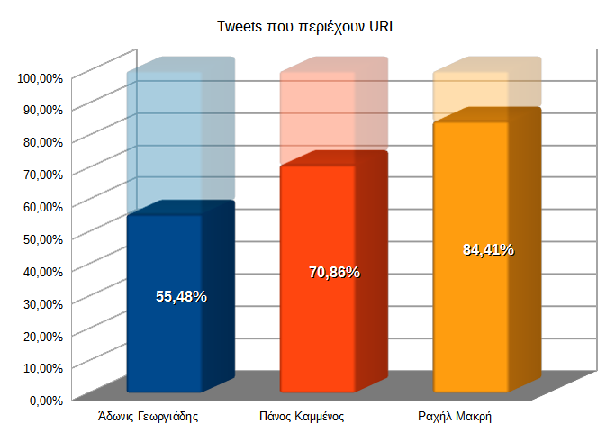
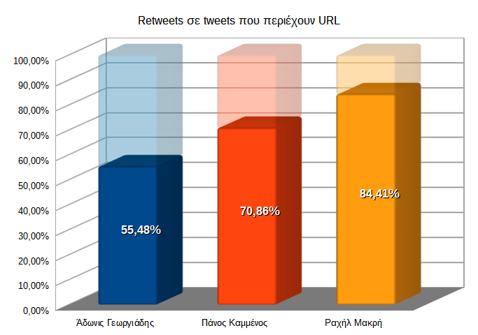
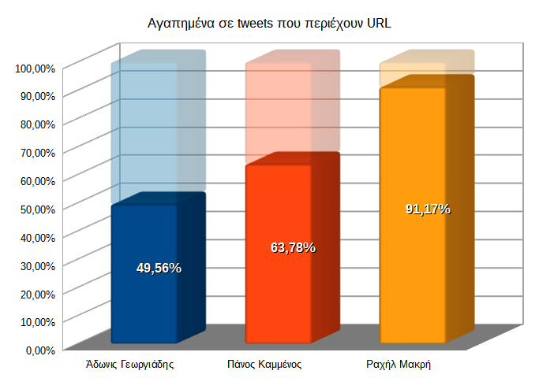


# Tweets με URL και δημοτικότητα

Πιο πάνω αναφέρθηκε η υπόθεση ότι η Ραχήλ Μακρή εμφανίζει πολλά συναισθηματικά
ουδέτερα tweets επειδή δημοσιεύει κυρίως φωτογραφίες και βιντεάκια.

Ένας απλός τρόπος για να τεστάρουμε αυτήν την υπόθεση είναι να ελέγξουμε αν τα 
tweets περιέχουν URL, κάτι που φανερώνει κοινοποίηση τρίτου πράγματος.

Έχει γίνει πρόβλεψη ώστε το πρόγραμμα να ελέγχει κάθε tweet κατά τη φάση της
συλλογής τους. Θα μπορούσε να γίνει μέσω του Twitter API (μεταβλητή `entities`)
αλλά υλοποιήθηκε με έναν απλούστερο και πιο «πυθωνικό» (pythonic) τρόπο.  
Απλά ελέγχεται το tweet αν περιέχει τη συμβολοσειρά `'http'` με την ακόλουθη
λακωνική εντολή:

```python
contains_url = 1 if 'http' in tweet_text else 0
```

Το αποτέλεσμα (`1` ή `0`) αποθηκεύεται σε νέα στήλη στο `.csv`.

Ο λόγος που μπήκε `1`/`0` αντί `True`/`False` ή `ναι`/`όχι` ή κάτι άλλο είναι
ότι το `1`/`0` βολεύει στον πολλαπλασιασμό. Με έναν απλό πολλαπλασιασμό στο Calc
ξεχωρίζουμε τα μεν από τα δε tweets.

Αφού λοιπόν τα ξεχωρίσουμε και βγάλουμε σύνολα δημιουργούμε τα ακόλουθα
διαγράμματα:



Αμέσως γίνεται ξεκάθαρο ότι οι υποθέσεις σχετικά με το στυλ δημοσιεύσεων της 
Ραχήλ Μακρή αλλά και του Αδώνιδος Γεωργιάδη επαληθεύονται.

Πράγματι, η Ραχήλ Μακρή σε συντριπτικό ποσοστό 93,62% κάνει αναδημοσιεύεις. 
Πρωτότυπο κείμενο δημοσιεύει ελάχιστα.

Από την άλλη, ο Άδωνις Γεωργιάδης επαληθεύει την υπόθεση ότι γράφει κυρίως
κείμενο καθώς σχεδόν το 1/3 των tweets του δεν περιέχουν URL.

Ο Πάνος Καμμένος εμφανίζει μια πιο ενδιάμεση συμπεριφορά.

Ας δούμε όμως και τη συμπεριφορά του κοινού απέναντι στα tweets με URL.



Παρατηρούμε αμέσως μια αυξημένη τάση για κοινοποίηση των tweets χωρίς URL, 
δηλαδή αυτών με πρωτότυπο κείμενο. Φαίνεται ότι ο κόσμος προτιμάει
να αναδημοσιεύει κάτι πρωτότυπο παρά κάτι από δεύτερο χέρι.



Στην περίπτωση των αγαπημένων σε tweet με URL τα πράγματα αλλάζουν λίγο.

Εκτός από την περίπτωση της Ραχήλ Μακρή που το ποσοστό είναι πάλι συντριπτικό,
στους άλλους δύο η κατάσταση εμφανίζεται αντεστραμμένη σε σχέση με τα retweets.
Εδώ βλέπουμε μία τάση του κόσμου να βάζει *like* στον μεν Άδωνιν Γεωργιάδη στα
tweets με URL στον δε Πάνο Καμμένο στα tweets κειμένου.

Κατ' αρχάς όλη αυτή η αντίθεση ενισχύει για μια ακόμη φορά τον διαφορετικό 
χαρακτήρα των *retweet* σε σχέση με τα *like*.

Από κει και πέρα όμως είναι δύσκολο να ερμηνεύσουμε αυτήν την αντίθεση.

Μια υπόθεση ίσως είναι ότι τα *like* είναι τρόπον τινά πιο «φτηνά» από τα 
*retweet*, έχουν μικρότερο «κόστος» για αυτόν που τα κάνει. Έτσι τα βάζει 
ευκολότερα σε πράγματα που δεν θα χρειαστεί μετά να τα 
«υπερασπιστεί» ίσως στους «φίλους» του.

Αν το συνδυάσουμε αυτό με το συμπέρασμα που βγάλαμε πιο πριν ότι
τα tweets του Πάνου Καμμένου περιέχουν υψηλό βαθμό (θετικού) συναισθήματος
μπορούμε να υποθέσουμε ότι ο κόσμος, ενώ προτιμάει να αναδημοσιεύει κάτι πρωτότυπο, 
εντούτοις αναδημοσιεύει πιο εύκολα συναισθηματικά ουδέτερα tweets ενώ στα πιο 
φορτισμένα συναισθηματικά tweets αποφεύγει την αναδημοσίευση και προτιμάει να 
κάνει απλώς *like*. 
