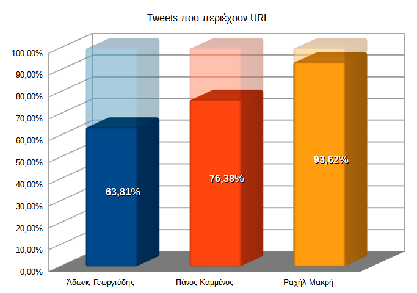

# Tweets με URL και δημοτικότητα

Πιο πάνω αναφέρθηκε η υπόθεση ότι η Ραχήλ Μακρή εμφανίζει πολλά συναισθηματικά
ουδέτερα tweets επειδή δημοσιεύει κυρίως φωτογραφίες και βιντεάκια.

Ένας απλός τρόπος για να τεστάρουμε αυτήν την υπόθεση είναι να ελέγξουμε αν τα 
tweets περιέχουν URL, κάτι που φανερώνει κοινοποίηση τρίτου πράγματος.

Έχει γίνει πρόβλεψη ώστε το πρόγραμμα να ελέγχει κάθε tweet κατά τη φάση της
συλλογής τους. Θα μπορούσε να γίνει μέσω του Twitter API (μεταβλητή `entities`)
αλλά υλοποιήθηκε με έναν απλούστερο και πιο «πυθωνικό» (pythonic) τρόπο.  
Απλά ελέγχεται το tweet αν περιέχει τη συμβολοσειρά `'http'` με την ακόλουθη
λακωνική εντολή:

```python
contains_url = 1 if 'http' in tweet_text else 0
```

Το αποτέλεσμα (`1` ή `0`) αποθηκεύεται σε νέα στήλη στο `.csv`.

Ο λόγος που μπήκε `1`/`0` αντί `True`/`False` ή `ναι`/`όχι` ή κάτι άλλο είναι
ότι το `1`/`0` βολεύει στον πολλαπλασιασμό. Με έναν απλό πολλαπλασιασμό στο Calc
ξεχωρίζουμε τα μεν από τα δε tweets.

Αφού λοιπόν τα ξεχωρίσουμε και βγάλουμε σύνολα δημιουργούμε τα ακόλουθα
διαγράμματα:



Αμέσως γίνεται ξεκάθαρο ότι οι υποθέσεις σχετικά με το στυλ δημοσιεύσεων της 
Ραχήλ Μακρή αλλά και του Αδώνιδος Γεωργιάδη επαληθεύονται.

Πράγματι, η Ραχήλ Μακρή σε ποσοστό 84,41% κάνει αναδημοσιεύεις. Πρωτότυπο
κείμενο δημοσιεύει ελάχιστα.

Από την άλλη, ο Άδωνις Γεωργιάδης επαληθεύει την υπόθεση ότι γράφει κυρίως
κείμενο καθώς σχεδόν τα μισά του tweets δεν περιέχουν URL.

Ο Πάνος Καμμένος εμφανίζει μια πιο ενδιάμεση συμπεριφορά.

Ας δούμε όμως και τη συμπεριφορά του κοινού απέναντι στα tweets με URL.


Παρατηρούμε αμέσως μια αυξημένη τάση για κοινοποίηση των tweets με URL, 
πρωτίστως της Ραχήλ Μακρή με το συντριπτικό ποσοστό 93,76%, αλλά και του 
Αδώνιδος Γεωργιάδη με μικρότερο αλλά σημαντικό ποσοστό κοντά στα 2/3.

Αντίθετα, στην περίπτωση του Πάνου Καμμένου παρατηρούμε μία τάση για κοινοποίηση
των tweets κειμένου έναντι αυτών με URL.

Αυτό μπορεί να σημαίνει ότι το κοινό ίσως δεν βρίσκει μεγάλο ενδιαφέρον στα
πρωτότυπα κείμενα της Ραχήλ Μακρή και του Αδώνιδος Γεωργιάδη και προτιμάει
να κάνει retweet τις αναδημοσιεύεις τους (δηλαδή υλικό τρίτων, π.χ. βιντεάκια).

Ενώ στα πρωτότυπα κείμενα του Πάνου Καμμένου το κοινό φαίνεται να βρίσκει 
ενδιαφέρον και τα κοινοποιεί σε μεγαλύτερο βαθμό από τις αναδημοσιεύεις του.

Αυτό έρχεται σε απόλυτη συμφωνία με το συμπέρασμα που βγάλαμε πιο πριν ότι
τα tweets του Πάνου Καμμένου περιέχουν υψηλό βαθμό (θετικού) συναισθήματος.
Προφανώς ο κόσμος θέλει να αναδημοσιεύει θετικά πράγματα.


Στην περίπτωση των αγαπημένων σε tweet με URL τα πράγματα αλλάζουν λίγο.

Εκτός από την περίπτωση της Ραχήλ Μακρή που το ποσοστό είναι πάλι συντριπτικό,
στους άλλους δύο η κατάσταση εμφανίζεται αντεστραμμένη σε σχέση με τα retweets.
Εδώ βλέπουμε μία τάση του κόσμου να βάζει *like* στον μεν Άδωνιν Γεωργιάδη στα
tweets κειμένου στον δε Πάνο Καμμένο στα tweets με URL.

Κατ' αρχάς όλη αυτή η αντίθεση ενισχύει για μια ακόμη φορά τον διαφορετικό 
χαρακτήρα των *retweet* σε σχέση με τα *like*.

Από κει και πέρα όμως είναι δύσκολο να ερμηνεύσουμε αυτήν την αντίθεση.

Μια υπόθεση ίσως είναι ότι τα *like* είναι τρόπον τινά πιο «φτηνά» από τα 
*retweet*, έχουν μικρότερο «κόστος» για αυτόν που τα κάνει. Έτσι τα βάζει 
ευκολότερα σε λιγότερο σημαντικά πράγματα που δεν θα χρειαστεί μετά να τα 
«υπερασπιστεί» ίσως στους «φίλους» του.

Συνοψίζοντας, το κοινό βαθμολογεί θετικά (*like*) τα πρωτότυπα κείμενα του 
Αδώνιδος Γεωργιάδη αλλά αναδημοσιεύει (*retweet*) τα μη πρωτότυπα αυτού ενώ
στην περίπτωση του Πάνου Καμμένου το κοινό αναδημοσιεύει τα πρωτότυπά του κείμενα
ενώ βαθμολογεί θετικά τα μη πρωτότυπά του.  
