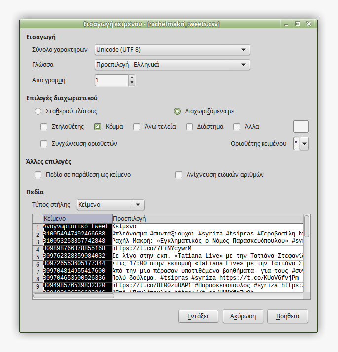

# Ανάλυση συναισθήματος με τεχνικές επεξεργασίας φυσικής γλώσσας

Το πρόγραμμα κατά τη συλλογή δεδομένων από το Twitter αναλύει κάθε tweet που
λαμβάνει και υπολογίζει το συναίσθημα που περιέχει. Η τιμή του συναισθήματος
αποθηκεύεται σε ξεχωριστό πεδίο στα αρχεία `.csv`.

## Αλγόριθμος ανάλυσης συναισθήματος

Για την ανάλυση συναισθήματος χρησιμοποιείται ένας βασικός αλγόριθμος 
επεξεργασίας φυσικής γλώσσας.


Αποτελείται από ένα **λεξικό συναισθήματος** δηλαδή μια συλλογή λέξεων με γνωστή
**τιμή συναισθήματος**. Η τιμή είναι απλά ένας αριθμός, το πρόσημο του οποίου 
δείχνει εάν πρόκειται για λέξη με θετικό ή αρνητικό συναίσθημα ενώ η τιμή του
είναι δείκτης του μεγέθους του συναισθήματος.

Ένα τέτοιο λεξικό είναι κάπως έτσι:

```
υγιης 2
ευτυχισμενος 1
καλος 5
εκπληκτικη 11
νομιμη 1
ανικανος -3
περιεργη -1
αδικο -2
```

Τα βήματα που ακολουθεί ο αλγόριθμος για να αναλύσει μία φράση είναι τα εξής:

1.  Φορτώνει το λεξικό ως greeklish μικρά
    ```
    for line in open('lexicon-file.txt'):
        word, score = line.split()
        greeklish_word = unidecode(word.decode('utf-8')).lower()
        lexico[greeklish_word] = int(score)
    ```
2.  Μετατρέπει τη φράση σε greeklish μικρά, και
3.  σπάει τη φράση σε λέξεις με βάση τα κενά:
    ```
    words = unidecode(tweet_text.decode('utf-8')).lower().split()
    ```
4.  Εντοπίζει κάθε λέξη στο λεξικό και λαμβάνει την τιμή της, και
5.  αθροίζει τις τιμές όλων των λέξεων και βγάζει το συνολικό συναισθηματικό 
σκορ της φράσης:
    ```
    sentiment = sum(lexico.get(word, 0) for word in words)
    ```

## Αδυναμίες του αλγορίθμου

Η πρώτη και κυριότερη αδυναμία του αλγορίθμου είναι το σπάσιμο σε λέξεις όπου
στην ουσία γίνεται με βάση τα κενά (συνάρτηση `split()`). Αυτό σημαίνει ότι αν 
υπάρχουν σημεία στίξης θα θεωρηθούν τμήματα της λέξης.

Αυτό λύνεται αν αντί για σπάσιμο στα κενά κάνουμε **tokenization** (δυστυχώς 
δεν υπάρχει ελληνική λέξη να αποδώσει αυτόν τον όρο). Ως *tokenization* νοείται
ο εντοπισμός των συστατικών στοιχείων της πρότασης, όχι απλά ως λέξεις αλλά
ως δομικά στοιχεία, π.χ. ρήμα, υποκείμενο, επίθετο κλπ.

Αυτό και άλλα πολλά τα κάνει η βιβλιοθήκη [NLTK](http://www.nltk.org/) 
(Natural Language Toolkit). Δυστυχώς η συγκεκριμένη βιβλιοθήκη δουλεύει μόνο
σε Python 3.x και μάλιστα μόνο στην 32μπιτη έκδοση. Η Python 3.x όμως στερείται
της πληθώρας των άλλων βιβλιοθηκών που έχει η Python 2.x.

Μια άλλη αδυναμία είναι τα Ελληνικά τα οποία έχουν τόνους, πτώσεις, χρόνους
και γενικά πολλές μορφές. Με την μετατροπή σε greeklish λύνεται εν μέρει αυτό
το πρόβλημα. Η λέξη «greeklish» χρησιμοποιείται εδώ καταχρηστικά. Στην 
πραγματικότητα δεν μετατρέπεται σε greeklish αλλά γίνεται μεταγραφή των 
χαρακτήρων στο ηχητικό τους ανάλογο σε ASCII (συνάρτηση `unidecode()`).
Κατά τη μετατροπή αυτή οι λέξεις απλοποιούνται και μπορεί να χάσουν ένα ποσό
πληροφορίας (π.χ. τόσο το «ε» όσο και το «η» μετατρέπονται σε «e»).

## Το λεξικό

Όλη η δύναμη του αλγορίθμου αυτού βρίσκεται στο λεξικό. Δυστυχώς, ενώ για τα 
Αγγλικά υπάρχουν πολλά έτοιμα *συναισθηματικά λεξικά* που μπορεί να κατεβάσει
κανείς δωρεάν από το Διαδίκτυο, για τα Ελληνικά δεν υπάρχει κάτι τέτοιο.

Για την επίλυση της παρούσας εργασίας χρησιμοποίησα ένα λεξικό που το έφτιαξα
με το λογισμικό **NiosTo** (βλ. [Credits](../credits.md)).

Αυτό που έκανα ήταν να εισαγάγω στο *NiosTo* όλα τα tweets που συνέλεξα από τους 
τρεις λογαριασμούς και να δημιουργήσω ένα λεξικό μόνο για αυτά.

Πρόκειται για το αρχείο 
[lexico.txt](https://github.com/Protonotarios/get-tweets/blob/version02/lexico.txt)
το οποίο συνοδεύει το πρόγραμμα.

Προφανώς το λεξικό αυτό λειτουργεί άψογα με τα συγκεκριμένα tweets αλλά 
πιθανότατα δεν θα λειτουργεί πολύ καλά με μια άλλη συλλογή tweets.

Μπορείτε να φορτώσετε το δικό σας λεξικό αρκεί να το δηλώσετε στο αρχείο
ρυθμίσεων 
[config.py](https://github.com/Protonotarios/get-tweets/blob/version02/config.py).

### Δημιουργία λεξικού με το NiosTo

Το *NiosTo* δέχεται αρχεία `.xls` όπου το προς ανάλυση κείμενο πρέπει να βρίσκεται
στη δεύτερη στήλη. Η δεύτερη προϋπόθεση πληρούται καθώς κατά την
κατασκευή του `get-tweets.py` έχει προβλεφθεί ώστε τα εξαγόμενα `.csv` 
να έχουν το κείμενο των tweets στη δεύτερη στήλη.

Αυτό που μένει λοιπόν είναι να τα μετατρέψουμε σε `.xls`.

Ανοίγουμε ένα ένα τα αρχεία `.csv` με επεξεργαστή λογιστικών φύλλλων 
(προτείνεται το [LibreOffice Calc](https://el.libreoffice.org/)).

Κατά το άνοιγμα φροντίζουμε:

* το σύνολο χαρακτήρων να είναι **UTF-8**,
* η γλώσσα να είναι **Ελληνικά**, και
* το διαχωριστικό στηλών να είναι το **κόμμα** (`,`) και κανένα άλλο 
(αυτό είναι σημαντικό γιατί ορισμένα tweets περιέχουν ερωτηματικά ή άλλους
χαρακτήρες που χρησιμοποιούνται συνήθως ως διαχωριστικά).
* Επίσης, η πρώτη στήλη με το αναγνωριστικό (id) κάθε tweet πρέπει να
μορφοποιηθεί ως **κείμενο**. Επιλέγουμε ολόκληρη τη στήλη κάνοντας κλικ
στην κεφαλίδα της που λέει `Προεπιλογή` και το αλλάζουμε σε `Κείμενο`.



* Σημαντικό επίσης η στήλη με την ημερομηνία να οριστεί ως `Ημερομηνία ΕΜΗ`.


Αφού το αρχείο ανοίξει και βεβαιωθούμε ότι οι στήλες απεικονίζονται
σωστά, το αποθηκεύουμε ως `.xls`.

Στη συνέχεια κάνουμε το ίδιο με τα άλλα δύο αρχεία μόνο που αντί να τα 
αποθηκεύσουμε, αντιγράφουμε τα δεδομένα τους στο πρώτο ώστε να έχουμε όλα
τα tweets σε ένα φύλλο.

Στη συνέχεια περνάμε στο πρόγραμμα *NiosTo* για να κάνουμε την ανάλυση.

Πρώτα από όλα πηγαίνουμε στο μενού `File` → `Options` και επιλέγουμε:

`Language Extraction` → `Greek`

Στη συνέχεια φορτώνουμε το αρχείο `.xls` και πατάμε `Start Lexicon Extraction`
και θα δημιουργηθεί το λεξικό.

Τέλος το λεξικό μπορούμε να το μεταφέρουμε σε ένα σημειωματάριο και να το 
επεξεργαστούμε ώστε να το φέρουμε στη ζητούμενη μορφή: `λέξη αριθμός`.

