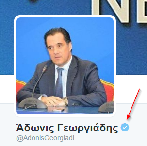

# Οι λογαριασμοί της δοκιμής

Αν ανοίξουμε το αρχείο 
[user data.csv](https://github.com/Protonotarios/get-tweets/blob/version02/docs/%CE%A0%CE%B1%CF%81%CE%AC%CE%B4%CE%B5%CE%B9%CE%B3%CE%BC%CE%B1/user%20data.csv)
θα δούμε ότι έχει συλλέξει ένα πλήθος στοιχείων για τους λογαριασμούς.

Κάποια βασικά στοιχεία παρουσιάζονται στον ακόλουθο πίνακα:

|                     |  |  |  |
| ------------------- | ------------------------ | ---------------------- | -------------------- |
| Όνομα χρήστη        | AdonisGeorgiadi          | PanosKammenos          | rachelmakri          |
| Πραγματικό όνομα    | Άδωνις Γεωργιάδης        | Panos Kammenos         | Rachel Makri         |
| Ημερομηνία εγγραφής | 31/08/2009               | 15/09/2009             | 19/08/2012           |
| Τοποθεσία           | Greece                   | Αθήνα                  | Ελλάδα               |
| Ζώνη ώρας           | Athens                   | Athens                 | Baghdad              |
| Γλώσσα διεπαφής     | Αγγλικά                  | Αγγλικά                | Ελληνικά             |
| Αριθμός ακολούθων   | **157.296**              | 72.390                 | 24.203               |
| Ακολουθεί           | **3.585**                | 415                    | 223                  |
| Αριθμός tweets      | **85.158**               | 11.468                 | 9.188                |
| Αριθμός αγαπημένων  | 3.406                    | **3.791**              | 51                   |
| Αριθμός λιστών που ανήκει | 892                | 733                    | 255                  |
| Επαληθευμένος λογαριασμός; | **Ναι**           | Όχι                    | Όχι                  |

## Σημειολογικές παρατηρήσεις

### Όνομα χρήστη

Ο Άδωνις Γεωργιάδης και ο Πάνος Καμμένος έχουν το πρώτο γράμμα κεφαλαίο στο όνομα 
χρήστη ώστε να διαβάζεται σαν δύο λέξεις. Η Ραχήλ Μακρή τα έχει όλα μικρά σαν μία λέξη.

Από το όνομα χρήστη του Αδώνιδος Γεωργιάδη λείπει το τελευταίο γράμμα: `AdonisGeorgiadi`

Δεν πρόκειται για λάθος αλλά οφείλεται στο ότι το Twitter έχει περιορισμό 15 
γραμμάτων στο όνομα χρήστη.

Ο Άδωνις Γεωργιάδης προτίμησε να κόψει από το επώνυμό του αφού είναι κυρίως το 
μικρό του που λειτουργεί ως «σήμα κατατεθέν».

### Ημερομηνία δημιουργίας

Ο Άδωνις Γεωργιάδης και ο Πάνος Καμμένος άνοιξαν σχεδόν ταυτόχρονα λογαριασμούς
το 2009 ενώ η Ραχήλ Μακρή τρία χρόνια αργότερα.

### Ρυθμίσεις διεπαφής

Οι ρυθμίσεις διεπαφής είναι κάτι που δεν φαίνεται στον επισκέπτη αλλά το βλέπει
μόνο ο ίδιος ο χρήστης.

Ενδιαφέρον προκαλεί το γεγονός ότι τόσο ο Άδωνις Γεωργιάδης όσο και ο Πάνος Καμμένος
έχουν το περιβάλλον του Twitter ρυθμισμένο στα Αγγλικά (δηλαδή το Twitter 
απευθύνεται σε αυτούς στα Αγγλικά). Κάτι τέτοιο είναι σύνηθες σε ανθρώπους
που έχουν ζήσει ή σπουδάσει σε αγγλόφωνες χώρες. Ωστόσο ο Άδωνις Γεωργιάδης
έχει σπουδάσει στην Αθήνα ενώ ο Πάνος Καμμένος σπούδασε στην Λυών και μετά στην Ελβετία.
Από αυτήν την άποψη θα ήταν ίσως πιο κατανοητό αν είχε ως γλώσσα διεπαφής του
Twitter τα Γαλλικά.

Ένα άλλο ενδιαφέρον σημείο είναι η ρύθμιση της ζώνης ώρας, που επίσης είναι 
ρύθμιση διεπαφής, δηλαδή επηρεάζει μόνο τον χρήστη. 

Η Ραχήλ Μακρή έχει βάλει ως ζώνη ώρας τη Βαγδάτη που είναι +1 ώρα σε σχέση με
την Ελλάδα. Αυτό σημαίνει ότι βλέπει όλες τις πληροφορίες του Twitter με μια ώρα
λάθος. Δηλαδή αν στείλει κάποιος ένα tweet στη Ραχήλ Μακρή στις 2:00 μμ 
εκείνη θα δει ότι το μήνυμα στάλθηκε στις 3:00 μμ.

### Επαλήθευση λογαριασμού

Από τους τρεις πολιτικούς μόνο ο Άδωνις Γεωργιάδης έχει επαληθεύσει το λογαριασμό
του στο Twitter.

Η επαλήθευση του λογαριασμού έχει διπλή σημασία. Από τη μια εξασφαλίζει το χρήστη
ότι δεν θα χάσει ποτέ την πρόσβαση στο λογαριασμό του και από την άλλη
παρέχει επίσης εξασφάλιση στους επισκέπτες ότι ο χρήστης είναι αυτός που λέει.

Αυτό το τελευταίο φαίνεται εμφανώς στη σελίδα χρήστη δίπλα στο όνομα.

> Η προσωπική μου άποψη είναι ότι ένα δημόσιο πρόσωπο, όπως ένας βουλευτής ή ένας υπουργός,
που χρησιμοποιεί το Twitter ως βήμα για να κάνει πολιτικές δηλώσεις, θα έπρεπε να
το κάνει με επαληθευμένο λογαριασμό.

## Στατιστικά στοιχεία

Ο Άδωνις Γεωργιάδης κατέχει το ρεκόρ με **157.296** ακολούθους. Να σημειωθεί
ότι οι ακόλουθοί του είναι διπλάσιοι από τις ψήφους που πήρε στις τελευταίες 
εκλογές (70.853). Αυτό σημαίνει ότι τον ακολουθούν χρήστες από το ευρύτερο πολιτικό
φάσμα και όχι μόνο οι οπαδοί του.

Ο Πάνος Καμμένος, αν και κατέχει το λογαριασμό τον ίδιο χρόνο με τον Άδωνι Γεωργιάδη,
έχει τους μισούς ακολούθους.

Αυτό οφείλεται προφανώς και στον αριθμό των tweets καθενός αλλά και στα άτομα που ακολουθεί.

Ο Άδωνις Γεωργιάδης κατέχει επίσης το ρεκόρ και στα δύο αυτά με **85.158** 
tweets έναντι 11.468 του Πάνου Καμμένου και **3.585** άτομα που ακολουθεί
έναντι 415 του Πάνου Καμμένου. 

Το μόνο σημείο που υπερέχει οριακά ο Πάνος Καμμένος είναι στο αριθμό των αγαπημένων
(κοινώς «like») που έχει που είναι 3.791 έναντι 3.406 του Αδώνιδος Γεωργιάδη.

Η Ραχήλ Μακρή δεν κάνει καθόλου *like*, άγνωστο γιατί.

Όλα αυτά φανερώνουν ότι ο Άδωνις Γεωργιάδης αντιλαμβάνεται και κατ' επέκταση 
αξιοποιεί το Twitter περισσότερο από τον Πάνο Καμμένο. Ρίχνει βάρος στο να 
*ακολουθεί* (που είναι ο τρόπος του Twitter) παρά στο να κάνει *like* (που είναι
ο τρόπος του Facebook). Επίσης ακολουθεί τους πάντες. Προφανώς δεν μπορεί
να παρακολουθεί πραγματικά τρεισήμισι χιλιάδες χρήστες. Το κάνει γιατί **έτσι
πρέπει να κάνει σε αυτόν το χώρο**. Και ο χώρος με τη σειρά του τον ανταμείβει.
