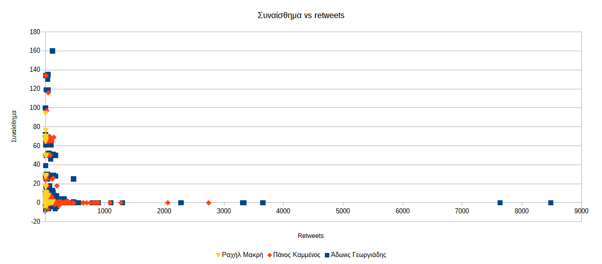
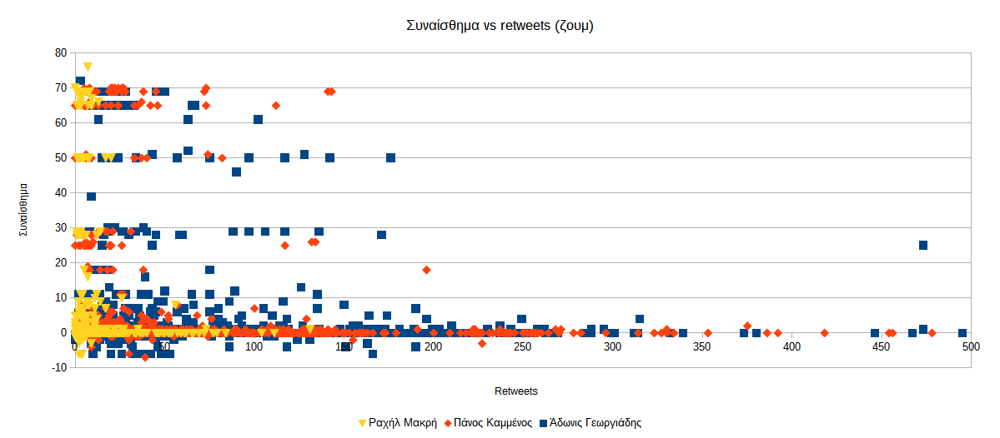
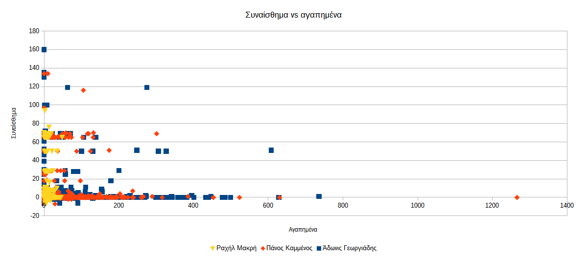
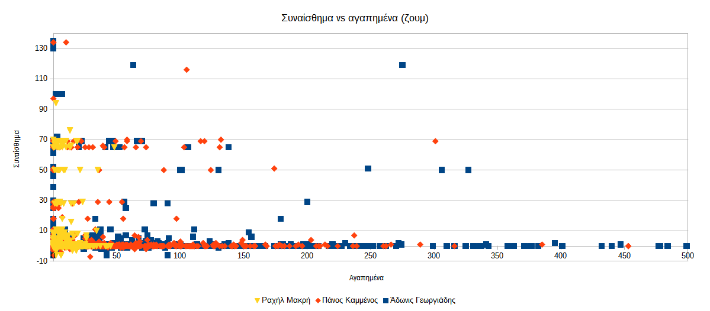


# Συναίσθημα σε σχέση με τη δημοτικότητα

Η δημοτικότητα ενός tweet εκφράζεται με δύο τρόπους, 

1.  με τον αριθμό των **retweet** (αναδημοσιεύσεων), ή/και
2.  με τον αριθμό των **αγαπημένων** (like) που έχει λάβει.

Για την κατασκευή συγκριτικών διαγραμμάτων για όλους τους χρήστες και όλα 
τα tweets τους συνδυάζουμε όλα τα αρχεία των χρηστών σε ένα νέο
αρχείο λογιστικών φύλλων.

> Μπορείτε να κατεβάσετε το έτοιμο συνενωμένο αρχείο με τα διαγράμματα του 
παραδείγματος: 
[tweets.ods](https://github.com/Protonotarios/get-tweets/blob/version02/docs/%CE%A0%CE%B1%CF%81%CE%AC%CE%B4%CE%B5%CE%B9%CE%B3%CE%BC%CE%B1/tweets.ods)

## Retweets

Αρχικά δημιουργούμε ένα διάγραμμα διασποράς του συναισθήματος σχετικά με τα
retweets για κάθε tweet.

Με μια πρώτη ματιά δεν φαίνεται κάποια σημαντική σχέση αυτών των δύο.

Τα περισσότερα tweets εμφανίζονται *κολλημένα* στους άξονες. Αυτό σημαίνει ότι 
υπάρχουν πολλά tweets με υψηλό βαθμό συναισθήματος που έχουν σχεδόν μηδενικά
retweets και αντίστροφα, πολλά tweets που έχουν σημαντικό αριθμό retweets αλλά 
ουδέτερο συναίσθημα.

Μπορούμε να αφαιρέσουμε τις ακραίες τιμές συναισθήματος και retweets, δηλαδή 
να ζουμάρουμε το διάγραμμα στις πιο χαμηλές τιμές.

Εδώ μπορούμε να δούμε περισσότερα σημεία εσωτερικά του διαγράμματος αλλά και πάλι
η μεγάλη πλειοψηφία παραμένει κοντά στους άξονες φανερώνοντας μικρή σχέση 
ανάμεσα στο συναίσθημα και τα retweets.

## Αγαπημένα

Στην περίπτωση των *αγαπημένων* τα πράγματα είναι ελαφρώς διαφορετικά.

Εδώ παρατηρούμε μια ελαφρώς μεγαλύτερη διασπορά στο επίπεδο 
που υποδηλώνει μεγαλύτερη σχέση
μεταξύ συναισθήματος ενός tweet και αγαπημένων που έχει λάβει.

Αυτή η διαφορά είναι ένα ακόμα στοιχεία που δείχνει τον διαφορετικό χαρακτήρα
των retweet με τα αγαπημένα.

Φαίνεται λοιπόν ότι ο κόσμος κάνει retweet ανεξαρτήτως συναισθήματος που 
εμπεριέχεται στο tweet. Όταν όμως πρόκειται να βάλει ένα αγαπημένο τότε φαίνεται
να επηρεάζεται περισσότερο από τη θετικότητα του συναισθήματος.

Ίσως αυτό έχει να κάνει και με τον χαρακτήρα του *αγαπημένου* γενικότερα.

> Πότε κάνουμε *like*;
> Όταν μας αρέσει αυτό που ειπώθηκε ή όταν μας αρέσει το γεγονός ότι ειπώθηκε.
> Όταν κάποιος γράψει ότι απολύθηκε από τη δουλειά του, τι σημαίνει το *like* εκεί;
> Σημαίνει ότι δηλώνουμε υποστήριξη στο άτομο ή σημαίνει ότι μας αρέσει που έχασε
τη δουλειά του;

Ακριβώς λοιπόν επειδή ο χαρακτήρας του *like* είναι διφορούμενος, φαίνεται ότι 
ο κόσμος τείνει να βάζει *like* σε tweets με θετικό συναίσθημα.