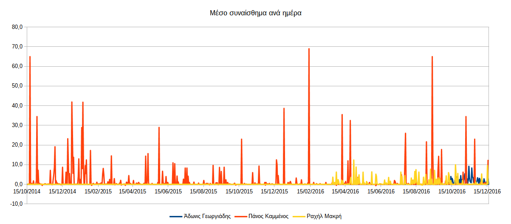
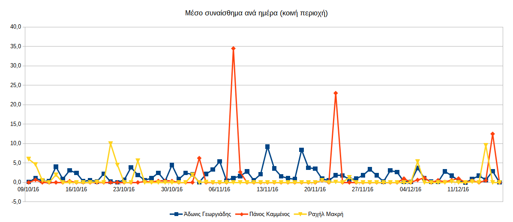
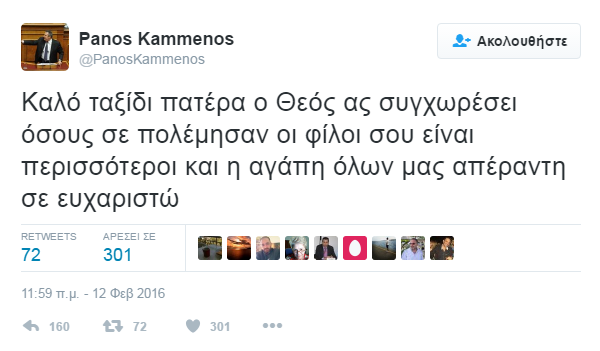


# Συναίσθημα σε σχέση με το χρόνο


Για να δούμε πώς διακυμαίνεται το συναίσθημα σε σχέση με το χρόνο πρέπει να 
υπολογίσουμε το μέσο συναίσθημα κάθε ημέρας.

Ανοίγουμε το αρχείο `final_tweets.csv` στο Calc και για κάθε χρήστη εισάγουμε
μια νέα στήλη στα δεξιά στην οποία θα βάλουμε το μέσο όρο ανά tweet της ημέρας,
διαιρώντας το αθροιστικό συναίσθημα της ημέρας με τον αριθμό των tweets αυτής
της ημέρας. Επειδή κάποιες μέρες δεν υπάρχουν tweets πρέπει να αποφύγουμε τη
διαίρεση με το μηδέν με μια απλή συνάρτηση `IF`.

Για παράδειγμα, το σύνολο των tweets κάθε ημέρας του Αδώνιδος Γεωργιάδη 
βρίσκονται στη στήλη `B` ενώ το αθροιστικό συναίσθημα αυτής της ημέρας βρίσκεται
στη στήλη `E`. Οπότε εισάγουμε μια νέα στήλη `F` δεξιότερα και στο πρώτο κελί
`F2` βάζουμε τον τύπο:

```
=IF(B2;E2/B2;0)
```

και αναπαράγουμε τον τύπο μέχρι την τελευταία γραμμή.

Κάνουμε το ίδιο για τους υπόλοιπους χρήστες.

Στη συνέχεια δημιουργούμε ένα διάγραμμα με τρεις σειρές δεδομένων, μία για κάθε
χρήστη χρησιμοποιώντας τα περιεχόμενα των κελιών με το μέσο συναίσθημα, ενώ ως
περιοχή ετικετών βάζουμε τη στήλη `A` με τις ημερομηνίες.

Το αποτέλεσμα είναι το ακόλουθο:



Παρατηρούμε όμως ότι οι τρεις χρήστες δεν έχουν το ίδιο εύρος ημερομηνιών.
Αυτό συμβαίνει λόγω του περιορισμού του Twitter στα 3240 πιο πρόσφατα tweets. 
Σαν αποτέλεσμα αυτού, χρήστες με πολλά tweets ανά ημέρα είχαν συνολικά μικρό 
εύρος ημερών και το αντίστροφο. Πιο συγκεκριμένα, ο Άδωνις Γεωργιάδης που κάνει
τα πιο πολλά tweets ανά ημέρα έκανε 3240 tweets την περιόδο 11/9/2016 έως σήμερα 
δηλαδή μόλις σε 2 μήνες ενώ ο Πάνος Καμμένος για παράδειγμα που τουΐταρε πολύ 
πιο αραιά έκανε την ίδια ποσότητα tweets από τις 28/9/2014 έως σήμερα δηλαδή σε 
περίοδο 2 ετών!

Έτσι δημιουργούμε ένα νέο διάγραμμα που παίρνει στοιχεία μόνο από τις ημερομηνίες
που είναι κοινές και στους τρεις. Κάτι σαν να ζουμάρουμε το διάγραμμα στην κοινή
περιοχή. 

Το αποτέλεσμα είναι το ακόλουθο:



Τα διαγράμματα μπορούν να βρεθούν στο αρχείο
[final_tweets.ods](https://github.com/Protonotarios/get-tweets/blob/version02/docs/%CE%A0%CE%B1%CF%81%CE%AC%CE%B4%CE%B5%CE%B9%CE%B3%CE%BC%CE%B1/final_tweets.ods).

## Παρατηρήσεις

Το πρώτο πράγμα που παρατηρούμε είναι η έλλειψη αρνητικών συναισθημάτων. Όλα τα
tweets όλων κινούνται μεταξύ του συναισθηματικά ουδέτερου έως το έντονα θετικό.

Επίσης είναι εμφανής η μεγάλη διαφορά του Πάνου Καμμένου από τους άλλους. Ενώ 
οι άλλοι δύο είναι λίγο πολύ στα ίδια, ο Πάνος Καμμένος εμφανίζει πολύ θετικότερα
συναισθήματα. Από την άλλη, είναι ο μόνος που φαίνεται να έχει και 
κάποια ελάχιστα αρνητικά (παρατηρήστε στο πάνω διάγραμμα κάποιες
μικρές κόκκινες μυτούλες που διακρίνονται σπαραδικά κάτω από τον άξονα). Μιλάμε για πολύ 
μικρές τιμές, ωστόσο υπάρχουν, κάτι που απουσιάζει από τους άλλους δύο.

Θα μπορούσαμε να κάνουμε την υπόθεση ότι ο Πάνος Καμμένος είναι πιο συναισθηματικός
σαν χαρακτήρας κι έτσι έχει έντονα θετική στάση αλλά κάποιες φορές του 
βγαίνει και λίγη αρνητικότητα.

Βέβαια, η ουσία είναι ότι και οι τρεις είναι πολιτικοί και προσέχουν πολύ τα 
λόγια τους και μάλλον έτσι εξηγείται η ουσιαστική έλλειψη αρνητικών συναισθημάτων.

Μεταξύ του Αδώνιδος Γεωργιάδη και της Ραχήλ Μακρή παρατηρούμε επίσης κάποιες 
διαφορές, ειδικά στο δεύτερο διάγραμμα. Ενώ και οι δύο κινούνται στο ίδιο 
συναισθηματικό εύρος, εντούτοις ο Άδωνις Γεωργιάδης εμφανίζει συνεχώς μια
θετικότητα ενώ η Ραχήλ Μακρή δημοσιεύει κατά κανόνα ουδέτερα tweets και πιο
σπάνια συναισθηματικά φορτισμένα. 

Αυτό μπορεί να υποδηλώνει ότι ο Άδωνις Γεωργιάδης είναι πιο παθιασμένος γενικά
(κάτι που επιβεβαιώνεται και από τον μεγάλο αριθμό συνολικών tweets σε σχέση με
τους άλλους) αλλά μπορεί και να σημαίνει επίσης ότι η Ραχήλ Μακρή κοινοποιεί
πολλές εικόνες και βιντεάκια χωρίς δικό της σχολιασμό ενώ ο Άδωνις Γεωργιάδης
εστάζει περισσότερο στο κείμενο.

### Το tweet με το θετικότερο συναισθηματικό σκορ

Θα ήταν ενδιαφέρον να δούμε ενδεικτικά κάποιο από τα πιο συναισθηματικά
tweets του Πάνου Καμμένου για να δούμε αν όντως η ανάλυση συναισθήματος 
λειτουργεί σωστά.

Ας πάρουμε το πιο υψηλό σε σύνολο συναισθηματικής βαθμολογίας. Από το πάνω
διάγραμμα φαίνεται ότι είναι λίγο πριν τις 15/2/2016. Αν ανοίξουμε το αρχείο
[final_tweets.ods](https://github.com/Protonotarios/get-tweets/blob/version02/docs/%CE%A0%CE%B1%CF%81%CE%AC%CE%B4%CE%B5%CE%B9%CE%B3%CE%BC%CE%B1/final_tweets.ods)
θα βρούμε εύκολα ότι η μέρα με το υψηλότερο θετικό συναίσθημα του Πάνου Καμμένου
είναι 12/2/2016 με μέση βαθμολογία 69. Στη συνέχει μπορούμε να ανοίξουμε το αρχείο 
[PanosKammenos_tweets.csv](https://github.com/Protonotarios/get-tweets/blob/version02/docs/%CE%A0%CE%B1%CF%81%CE%AC%CE%B4%CE%B5%CE%B9%CE%B3%CE%BC%CE%B1/PanosKammenos_tweets.csv)
και εντοπίσουμε τα tweets εκείνης της ημέρας.

Εκείνη την ημέρα υπάρχει ένα και μόνο tweet με συναισθηματικό σκορ 69. Πρόκειται
για το tweet με αναγνωριστικό `698235006544691200`.

Μα βάση το αναγνωριστικό μπορούμε να δούμε το tweet απευθείας στο Twitter.
Το URL ενός οποιουδήποτε tweet είναι της μορφής:
```
https://twitter.com/ΟΝΟΜΑΧΡΗΣΤΗ/status/ΑΝΑΓΝΩΡΙΣΤΙΚΟ
```

Οπότε το URL του ζητούμενου tweet είναι:

[https://twitter.com/PanosKammenos/status/698235006544691200](https://twitter.com/PanosKammenos/status/698235006544691200?lang=el)



Πρόκειται πραγματικά για μια βαθιά ανθρώπινη στιγμή και δικαιολογημένα το
πρόγραμμα βαθμολόγησε αυτό το tweet με τόσο υψηλή βαθμολογία καθώς είναι
γεμάτο με θετικές λέξεις.

> Να σημειωθεί ότι δεν είχα ιδέα ποιο ήταν αυτό το tweet μέχρι να το ανοίξω και
πραγματικά εξεπλάγην με την ευστοχία του προγράμματος.


